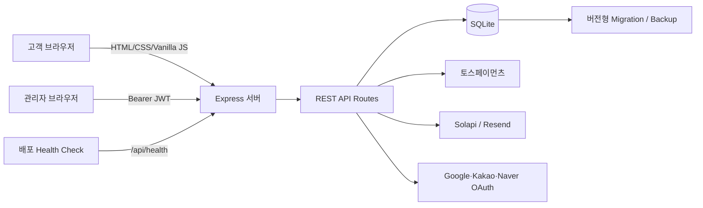
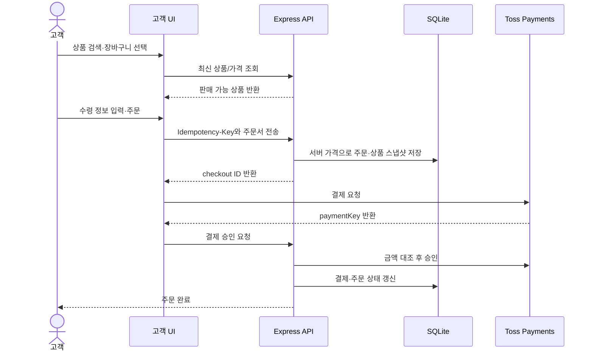
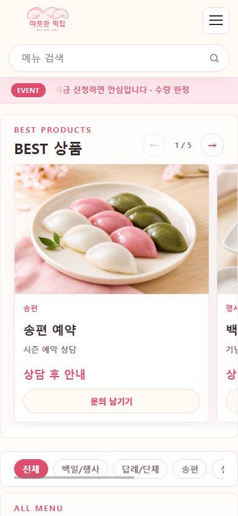

# 따뜻한 떡집

소규모 떡집의 고객 주문 경험과 매장 운영 업무를 하나로 연결한 1인 풀스택 포트폴리오 프로젝트입니다. 고객은 상품 검색, 장바구니, 회원가입, 주문과 결제를 이용하고 관리자는 주문·생산·재고·발주·고객·매출을 한 화면에서 관리합니다.

> 상호, 연락처, 회원 및 주문 데이터는 시연용입니다. SMS·이메일·소셜 로그인·실결제는 각 제공자의 운영 키를 넣었을 때만 활성화됩니다.

## 5분 빠른 실행

요구 사항은 Node.js 22.5 이상입니다.

```text
cd server
npm ci
```

PowerShell:

```powershell
Copy-Item .env.example .env
```

macOS/Linux:

```bash
cp .env.example .env
```

이어서 로컬 시연 계정 생성을 명시적으로 허용한 뒤 서버를 실행합니다. 시연 계정 생성은 운영 환경에서 차단됩니다.

```powershell
$env:ALLOW_PORTFOLIO_SEED="true"
npm run users:portfolio
npm start
```

`.env`에서 최소한 아래 값을 로컬 값으로 교체합니다.

```env
ADMIN_CODE=portfolio-admin
JWT_SECRET=local-jwt-secret-change-me-at-least-32-bytes
AUTH_CODE_PEPPER=local-phone-pepper-change-at-least-32-bytes
PUBLIC_BASE_URL=http://localhost:3000
```

브라우저에서 `http://localhost:3000`으로 접속합니다.

| 체험 대상 | 주소 | 사용 방법 |
|---|---|---|
| 고객 화면 | `/` | 메뉴 검색 → 장바구니 → 주문서 |
| 고객 로그인 | `/login.html` | `portfolio_user` / `User123!` |
| 관리자 ERP | `/admin.html` | `portfolio_admin` / `Admin123!` 로그인 후 헤더의 `관리자` 메뉴 선택 |
| 상태 확인 | `/api/health` | DB 상태와 마이그레이션 버전 확인 |

`demo:seed`는 운영 환경에서 실행이 차단됩니다. 로컬에서도 휴대폰 인증번호 원문은 화면·응답·로그에 노출하지 않으므로 Solapi를 연결하지 않은 상태에서는 위 데모 계정으로 로그인해 회원 기능을 확인합니다. 실제 신규 회원가입 전화 인증은 Solapi 설정 후 검증합니다.

## 주요 기능

### 고객

- 30개 서버 상품 카탈로그, 카테고리·검색·페이지네이션
- 키보드 조작 가능한 검색 패널, 최근 검색어 저장·개별 삭제
- 상품 가격·판매 상태를 서버에서 다시 검증하는 장바구니와 주문서
- 개별/전체 선택, 수량 변경, 삭제 실행 취소, 모바일 하단 주문 버튼
- 아이디·이메일 중복 확인, 휴대폰 인증, 주소 검색 회원가입
- 아이디 또는 이메일 로그인, HTTP-only 고객 쿠키, 로그인 임시 잠금
- 카카오·네이버·Google OAuth 연결 구조
- 일회용 이메일 링크 기반 비밀번호 재설정
- 주문 목록·상세·허용 상태 취소, 배송지·회원정보·비밀번호 관리, 회원 탈퇴
- 토스페이먼츠 결제 승인·재시도·취소 흐름

### 관리자 ERP

| 영역 | 기능 |
|---|---|
| 주문 | 조회·등록·수정, 상태 이력, 다중 상품, 결제 링크, 인쇄, CSV/JSON |
| 고객 | 고객 정보, 메모, 주문 횟수·수량·매출 집계 |
| 생산 | 픽업일별 생산량, 배합 기준, 준비 완료와 재고 차감 |
| 재고·발주 | 안전재고, 부족 알림, 사용 이력, 발주·입고, 공급처 |
| 픽업·배송 | 날짜·수령 방식 필터, 물류 상태 관리 |
| 회계 | 상품·일자·월별 매출, 원가, 이익, 현금흐름, CSV |
| 운영 | 관리자 JWT, 활동 로그, SMS·알림톡, D-1 리마인더 |

## 시스템 구조



- 프런트엔드는 빌드 과정 없는 HTML/CSS/Vanilla JS 모듈로 구성했습니다.
- Express가 정적 페이지와 API를 같은 출처에서 제공해 고객 쿠키와 CORS 구성을 단순화했습니다.
- SQLite는 포트폴리오와 단일 매장 규모에 맞춘 선택이며, 영구 볼륨의 단일 인스턴스를 전제로 합니다.

## 고객 주문 흐름



주문 상품명·가격·원가·상태는 클라이언트 값을 신뢰하지 않고 DB 상품을 기준으로 결정합니다. 주문과 결제에는 중복 방지 키와 상태 잠금을 사용합니다.

## 기술 스택과 선택 이유

| 구분 | 기술 | 선택 이유 |
|---|---|---|
| Frontend | HTML5, CSS3, Vanilla JS 모듈 | 프레임워크 없이 DOM·상태·접근성 흐름을 직접 설계 |
| Backend | Node.js 22+, Express 4 | 작은 매장 API에 필요한 단순한 배포와 빠른 반복 |
| Database | `node:sqlite` | 별도 DB 서버 없이 트랜잭션·FK·인덱스·마이그레이션 구현 |
| 인증 | JWT, HTTP-only 쿠키, bcrypt | 회원 `role` 권한과 관리자 API를 분리하고 비밀번호 원문 미보관 |
| 외부 연동 | Toss v2, Solapi, Resend, OAuth | 결제·인증·알림의 실제 서비스 경계를 경험 |
| 운영 | Railway/Render, health check, CSP | 배포 실패와 데이터 유실을 고려한 운영 구조 검증 |
| 테스트 | `node:test`, Supertest | API, DB 제약, 보안 정책, 정적 UI 구조를 회귀 검증 |

## 프로젝트 구조

```text
ShoppingMall/
├── index.html · menu.html · cart.html · checkout.html
├── login.html · signup.html · mypage.html
├── admin.html · pay.html · privacy.html · terms.html · 404.html
├── js/
│   ├── api.js · state.js · components.js · search.js · cart.js · auth.js
│   └── admin/                 # dashboard, orders, customers, inventory 등
├── css/                       # tokens, layout, auth, commerce, admin, pages
├── server/
│   ├── index.js · config.js · db.js · migrations.js
│   ├── routes/ · middleware/ · services/ · scripts/
│   └── test/                  # API·DB·보안·UI 회귀 테스트
├── docs/                      # 운영·인증·설계 문서와 화면 캡처
├── railway.json · render.yaml
└── sw.js
```

## 테스트와 보안 정책

```bash
cd server
npm test
```

현재 자동 테스트는 **175개**이며 다음을 검증합니다.

- 회원가입·로그인·권한 분리·계정 잠금·타이밍 노출 완화
- 휴대폰 코드 HMAC 저장, 비밀번호 bcrypt, 재설정 토큰 일회성·만료
- 주문 가격 위변조 차단, 입력 제한, 다른 회원 주문 접근 차단
- 결제 금액 대조, 중복 승인 방지, 실패 재시도와 관리자 취소
- 상품 스키마·API·장바구니·마이페이지·마이그레이션
- CSP·보안 헤더·환경변수 시작 차단·헬스체크·백업 복원
- 모바일·키보드·모달 포커스·`aria-describedby` 정적 접근성 규칙

운영 보안 설정에는 허용 출처 CORS, CSP, HSTS, `Secure`·`HttpOnly`·`SameSite=Lax` 쿠키, 요청 ID 기반 JSON 오류 로그가 포함됩니다. 자세한 운영 절차는 [배포 및 데이터 운영 가이드](docs/DEPLOYMENT_OPERATIONS.md)를 참고합니다.

## 주요 화면

### 고객 메인


### 상품 카탈로그


### 관리자 매출 관리


### 모바일 홈과 상품 탐색

| 모바일 홈 | 모바일 상품 |
|---|---|
|  |  |

위 모바일 이미지는 서버 실행 중 `npm run portfolio:capture`로 Chrome 390×844 에뮬레이션에서 재생성할 수 있습니다. Windows 기본 Chrome 경로가 아니거나 macOS/Linux인 경우 `CHROME_PATH`를 설정합니다. 실제 iOS·Android 기기 확인은 배포 직전에 별도로 진행합니다.

## 트러블슈팅 사례

### 클라이언트 가격을 그대로 저장할 수 있었던 문제

초기 주문 API는 화면에서 전달한 상품명과 가격을 저장할 여지가 있었습니다. 상품 ID만 입력으로 받고 서버 DB에서 가격·판매 상태를 다시 조회하도록 변경했으며, 주문 상품 스냅샷과 중복 방지 키를 추가했습니다. 위변조 가격, 판매 중지 상품, 중복 요청 테스트로 회귀를 막았습니다.

### SQLite 재배포 시 데이터가 사라지는 문제

앱 컨테이너 파일시스템을 DB 위치로 사용하면 재배포 시 데이터가 사라집니다. `DB_PATH=/data/tteokjip.db`를 강제할 수 있도록 운영 검증을 추가하고 Railway/Render 영구 볼륨 설정, 버전형 마이그레이션, `VACUUM INTO` 백업과 복원 검증을 마련했습니다.

### 서비스 워커가 수정 전 파일을 보여주던 문제

정적 파일 캐시 우선 전략은 새 배포 직후 이전 UI를 보여줄 수 있었습니다. 페이지 탐색은 network-first, 정적 자산은 stale-while-revalidate로 분리하고 캐시 버전을 갱신하도록 변경했습니다.

### 인증 실패가 계정 존재 여부를 드러낼 수 있었던 문제

아이디 미존재와 비밀번호 오류 응답을 동일하게 만들고, 존재하지 않는 계정에도 bcrypt 비교 비용을 발생시켰습니다. 로그인 실패 횟수 제한, 휴대폰 코드·재설정 토큰 원문 미저장도 함께 적용했습니다.

## 배포 및 운영

- `railway.json`과 `render.yaml`에 빌드·시작 명령과 `/api/health`를 정의했습니다.
- Render 설정은 `/data` 영구 디스크를 선언합니다. Railway는 대시보드에서 `/data` 볼륨을 연결해야 합니다.
- 운영 필수 환경변수나 HTTPS 주소가 누락되면 서버 시작이 중단됩니다.
- `npm run db:backup`, `npm run db:restore -- <backup.db> --confirm`으로 백업·복원을 수행합니다.

- 실제 배포 주소: **도메인 확정 후 추가 예정**
- GitHub 저장소: [wlrjs1300-coder/ShoppingMall](https://github.com/wlrjs1300-coder/ShoppingMall)

## 알려진 제한사항

- SQLite이므로 영구 볼륨에 연결된 단일 서버 인스턴스만 지원합니다. 다중 인스턴스는 PostgreSQL 전환이 필요합니다.
- 관리자 인증은 매장 내부 공유 코드 방식이며 관리자별 계정·권한 단계는 없습니다.
- SMS, 이메일, 소셜 로그인, 실결제는 외부 서비스 계정·도메인·운영 키 없이는 활성화되지 않습니다.
- 개인정보 처리방침과 이용약관은 포트폴리오 초안이며 실제 영업 전 사업자 정보와 법률 검토가 필요합니다.
- 실제 모바일 기기, Lighthouse, 운영 HTTPS·Secure 쿠키 점검은 배포 주소 확정 후 남아 있습니다.
- 결제 웹훅은 결제사 조회를 통해 상태를 검증하지만 운영 전 공식 웹훅 보안 요구사항을 다시 확인해야 합니다.

## 구현 범위

기획, UI/UX, 프런트엔드, REST API, DB 모델링, 인증·결제·알림 연동 구조, 테스트와 배포 운영 문서까지 1인이 구현했습니다. 실제 외부 계정 발급, 사업자 심사, 도메인 연결과 법률 검토는 저장소 밖의 운영 작업으로 분리했습니다.
