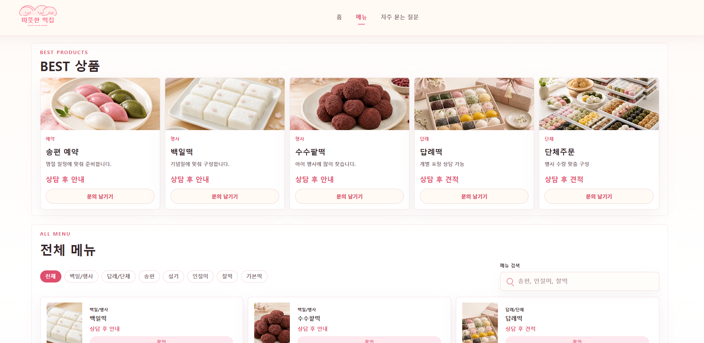
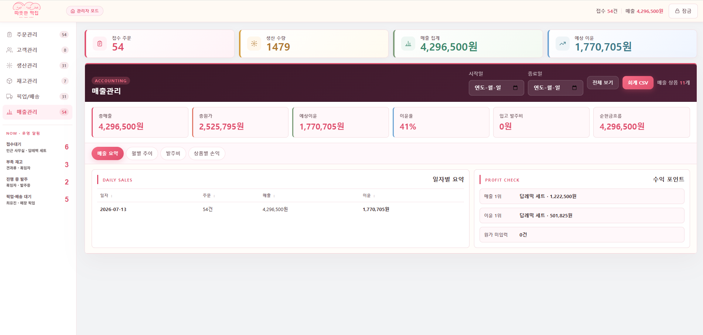

# 따뜻한 떡집

경기 화성 동탄 소재 떡집을 위한 온라인 쇼핑몰 + 관리자 ERP 시스템입니다.  
고객용 메뉴·주문 문의 페이지와 주문·생산·재고·매출을 한 화면에서 처리하는 관리자 대시보드로 구성됩니다.

> 개인 포트폴리오용으로 제작한 프로젝트입니다. 본 저장소에 사용된 매장 상호·연락처와
> 고객·주문 데이터는 시연을 위한 예시 데이터이며, 실제 개인정보나 사업장 정보가 아닙니다.

---

## 프로젝트 목적

소규모 떡집에서 전화·메신저로 흩어져 접수되던 주문을 한 곳에서 관리하고,
주문 접수부터 생산·재고 차감·매출 집계까지 하나의 흐름으로 처리하는 과정을
직접 설계하고 구현해본 개인 풀스택 포트폴리오 프로젝트입니다. 실제 매장에
바로 투입하는 상용 제품이 아니라, 소규모 매장 운영에 필요한 핵심 기능과
업무 흐름을 하나의 시스템으로 구현·검증해보는 데 목적을 두었습니다.

---

## 기술 스택

| 구분 | 사용 기술 |
|------|-----------|
| **Frontend** | HTML5, CSS3, Vanilla JS (ES2022) |
| **Backend** | Node.js 22+, Express 4 |
| **DB** | SQLite (`node:sqlite` — Node.js 내장, 별도 설치 불필요) |
| **인증** | JWT 기반 단일 관리자 인증 (`jsonwebtoken`) |
| **결제** | 토스페이먼츠 SDK v2 |
| **알림** | Solapi SMS·카카오 알림톡 (옵션) |
| **PWA** | Service Worker + Web App Manifest |

---

## 프로젝트 구조

```
쇼핑몰/
├── index.html          # 브랜드 홈페이지
├── menu.html           # 메뉴 목록 + 주문 문의 접수
├── faq.html            # 자주 묻는 질문
├── admin.html          # 관리자 ERP 대시보드
├── pay.html            # 토스페이먼츠 결제 페이지
├── script.js           # 전체 클라이언트 로직
├── styles.css          # 전체 스타일시트
├── sw.js               # PWA Service Worker
├── manifest.json       # PWA 매니페스트
├── assets/
│   ├── logo.svg
│   ├── tteok-hero.png
│   └── products/       # 상품 이미지
└── server/
    ├── index.js        # 서버 진입점 (Express)
    ├── db.js           # SQLite 스키마 초기화
    ├── .env            # 환경변수 (gitignore)
    ├── middleware/
    │   └── auth.js     # JWT Bearer 인증 미들웨어
    ├── routes/
    │   ├── auth.js           # POST /api/auth/login
    │   ├── orders.js         # /api/orders
    │   ├── customers.js      # /api/customers
    │   ├── inventory.js      # /api/inventory
    │   ├── recipes.js        # /api/recipes
    │   ├── purchase-orders.js# /api/purchase-orders
    │   ├── suppliers.js      # /api/suppliers
    │   ├── activity-logs.js  # /api/activity-logs
    │   ├── notify.js         # /api/notify
    │   └── payments.js       # /api/payments
    └── services/
        └── notify.js         # SMS·카카오 알림 발송 서비스
```

---

## 설치 및 실행

### 사전 요구사항

- **Node.js 22 이상** (내장 `node:sqlite` 사용)

### 1. 의존성 설치

```bash
cd server
npm install
```

### 2. 환경변수 설정

`server/.env` 파일을 생성하고 아래 값을 입력합니다.

```env
# 관리자 접근 코드
ADMIN_CODE=your-admin-code-here

# JWT 서명 시크릿 (운영 환경에서는 반드시 변경)
JWT_SECRET=your-secret-here

# 서버 포트 (기본값 3000)
PORT=3000

# 매장 정보 (알림 발송 시 사용)
STORE_NAME=따뜻한 떡집
STORE_PHONE=031-000-0000

# 알림 모드: none | sms | kakao
NOTIFICATION_MODE=none

# Solapi (SMS/카카오) — NOTIFICATION_MODE가 none이면 불필요
SOLAPI_API_KEY=
SOLAPI_API_SECRET=
SOLAPI_SENDER_PHONE=
KAKAO_PLUS_FRIEND_ID=

# 카카오 알림톡 템플릿 ID
KAKAO_TEMPLATE_ORDER=
KAKAO_TEMPLATE_READY=
KAKAO_TEMPLATE_REMIND=

# 토스페이먼츠 키 (샌드박스 테스트키로 시작 가능)
TOSS_CLIENT_KEY=test_ck_...
TOSS_SECRET_KEY=test_sk_...
```

### 3. 서버 실행

```bash
# 운영
npm start

# 개발 (파일 변경 감지, Node.js 22+ 내장 --watch)
npm run dev
```

서버가 `http://localhost:3000`에서 실행됩니다.

### 4. 사이트 접속

서버 실행 후 브라우저에서 아래 주소로 접속합니다.

| 페이지 | 주소 |
|--------|------|
| 홈 | `http://localhost:3000` 또는 `index.html` 직접 열기 |
| 메뉴·주문 | `menu.html` |
| FAQ | `faq.html` |
| 관리자 | `admin.html` |

> **참고 — 실행 모드:** 이 프로젝트는 두 가지 방식으로 동작합니다.
> - **서버 모드(기본)** — 위 과정대로 Express + SQLite 서버를 실행한 상태로 접속하는, 실사용을 전제로 한 기본 동작 방식입니다.
> - **데모 모드** — 서버 없이 `index.html` 등을 브라우저에서 바로 열면 `script.js`가 자동으로 localStorage를 저장소로 사용합니다. 서버 없이도 화면을 둘러볼 수 있도록 만든 포트폴리오 시연 전용 모드이며, 실제 고객 정보나 운영 데이터를 저장하는 용도가 아닙니다.

---

## 관리자 접근

1. `admin.html` 접속
2. `.env`의 `ADMIN_CODE` 값 입력 → 서버가 검증 후 JWT 발급
3. 이후 관리자 API 요청은 발급된 JWT로 인증되며, 우측 상단 **관리 잠금** 버튼으로 다시 잠글 수 있음

> 관리자 여러 명을 구분하는 계정 시스템이 아니라, 매장 내에서 공유하는 단일 코드로 관리자
> 화면 접근을 제한하는 방식입니다. 포트폴리오 시연 목적의 인증이며, 실제로 여러 명이 함께
> 쓰려면 계정별 로그인·비밀번호 해싱·로그인 시도 제한 같은 보강이 필요합니다.
>
> 테스트용 데모 데이터 버튼은 `admin.html?dev=1`로 접속 시에만 표시됩니다.

---

## 주요 기능

### 고객용 페이지

- **홈** (`index.html`) — 브랜드 소개, 주요 메뉴 안내, 매장 정보
- **메뉴** (`menu.html`) — 30개 메뉴 카탈로그, 카테고리·키워드 필터, 페이지네이션, 상품 상세, 주문 문의 접수
- **FAQ** (`faq.html`) — 주문·예약·배송 관련 자주 묻는 질문 아코디언

### 관리자 ERP (`admin.html`)

| 탭 | 기능 |
|----|------|
| **주문관리** | 주문 목록 조회·등록·수정·삭제, 상태 필터, 인쇄, 결제 링크 생성, CSV/JSON 내보내기·가져오기 |
| **고객관리** | 고객 등록·수정·삭제, 주문 이력 집계(횟수·수량·매출), 메모 |
| **생산관리** | 픽업일 기준 생산량 집계, 준비완료 처리 시 재고 자동 차감 |
| **재고관리** | 원재료 재고 CRUD, 안전재고·부족/주의 상태, 발주 요청·진행·입고 관리, 공급처 관리, 배합표 관리, 사용이력 로그 |
| **픽업/배송** | 날짜 필터, 수령방식·물류상태 관리 |
| **매출관리** | 상품별·일자별 매출 집계, 최근 12개월 월별 손익 차트, 순현금흐름, 회계 CSV |

### 결제 (`pay.html`)

- 관리자가 주문에서 결제 링크 생성 → 고객에게 링크 전달
- 토스페이먼츠 SDK v2로 결제 위젯 렌더링 → 결제 시도
- 서버가 결제 승인 API를 호출해 결제 금액을 주문 금액과 대조하고, 중복 승인을 방지한 뒤 주문 상태를 `결제완료`로 갱신

> 토스페이먼츠 **테스트(샌드박스) 환경** 기준으로 결제 승인 흐름을 구현했습니다. 실제 운영 키로
> 전환하려면 사업자 심사가 필요하며, 결제 위변조 방지를 위한 웹훅 서명 검증은 아직 구현하지
> 않았습니다.

### 알림

- **브라우저 알림** — 관리자 페이지(`admin.html`)를 열어 둔 상태에서 Web Notification API로
  D-1 픽업 안내, 재고 부족 경고를 표시 (탭을 닫으면 동작하지 않는 포그라운드 알림)
- **SMS·카카오 알림톡** — `NOTIFICATION_MODE=sms|kakao` + Solapi 설정 시 활성화 (기본값은 비활성)
  - 주문 접수 안내, 준비완료 안내, D-1 픽업 리마인더
  - 매일 오전 9시 자동 발송 스케줄러 내장

---

## 담당 구현

기획부터 프론트엔드·백엔드까지 1인 개발로 진행했습니다.

- 고객용 상품 조회 및 주문 문의 화면 (`index.html`, `menu.html`, `faq.html`)
- 관리자용 주문·고객·재고·생산·매출 관리 화면 (`admin.html`)
- Express 기반 REST API 설계 (`server/routes/*`)
- JWT 기반 단일 관리자 인증 미들웨어 (`server/middleware/auth.js`)
- `node:sqlite` 기반 데이터베이스 스키마 설계 (`server/db.js`)
- 토스페이먼츠 테스트 환경 기준 결제 승인 연동, Solapi SMS·카카오 알림톡 발송 연동 (`server/routes/payments.js`, `server/services/notify.js`)
- PWA(Service Worker)를 통한 정적 파일 캐싱과 포트폴리오 데모 모드(localStorage) 지원 (`sw.js`, `script.js`)

---

## API 엔드포인트

| 메서드 | 경로 | 인증 | 설명 |
|--------|------|------|------|
| `POST` | `/api/auth/login` | 불필요 | 관리자 로그인 → JWT 발급 |
| `GET/POST` | `/api/orders` | GET 필요 | 주문 목록 조회 / 주문 접수 |
| `PUT/DELETE` | `/api/orders/:id` | 필요 | 주문 수정·삭제 |
| `GET/POST/PUT/DELETE` | `/api/customers` | 필요 | 고객 CRUD |
| `GET/PUT/DELETE` | `/api/customers/notes/:key` | 필요 | 고객 메모 관리 |
| `GET/POST/PUT/DELETE` | `/api/inventory` | 필요 | 재고 CRUD |
| `GET/POST/DELETE` | `/api/inventory/logs` | 필요 | 재고 사용이력 |
| `GET/PUT/DELETE` | `/api/recipes` | 필요 | 배합표 관리 |
| `GET/POST/PUT/DELETE` | `/api/purchase-orders` | 필요 | 발주 CRUD |
| `GET/POST/PUT/DELETE` | `/api/suppliers` | 필요 | 공급처 CRUD |
| `GET/POST/DELETE` | `/api/activity-logs` | 필요 | 활동 로그 |
| `POST` | `/api/notify/test` | 필요 | 테스트 알림 발송 |
| `POST` | `/api/notify/reminders` | 필요 | 리마인더 즉시 실행 |
| `GET/POST` | `/api/payments` | 일부 | 결제 생성·조회·승인 |
| `GET` | `/api/health` | 불필요 | 헬스체크 |

---

## 데이터베이스

Node.js 22+ 내장 `node:sqlite` (`DatabaseSync`)를 사용해 별도 패키지 설치 없이 SQLite를 사용합니다.  
DB 파일은 `server/tteokjip.db`에 자동 생성됩니다.

| 테이블 | 설명 |
|--------|------|
| `orders` | 주문 |
| `customers` | 고객 |
| `customer_notes` | 고객 메모 |
| `inventory` | 재고 품목 |
| `inventory_logs` | 재고 사용이력 |
| `recipes` | 상품별 원재료 배합표 |
| `purchase_orders` | 발주 |
| `suppliers` | 공급처 |
| `activity_logs` | 운영 활동 로그 |
| `payments` | 결제 내역 |

---

## 오프라인 동작

서버가 실행되지 않은 경우 `script.js`는 자동으로 localStorage를 저장소로 사용합니다(데모 모드).  
서버가 다시 기동되고 관리자로 로그인하면 localStorage에 쌓인 데이터가 API와 동기화됩니다.  
PWA Service Worker(`sw.js`)로 정적 파일을 캐시해 오프라인에서도 페이지 열람이 가능합니다.
(데모 모드에 대한 자세한 설명은 위 "설치 및 실행" 섹션의 실행 모드 안내를 참고하세요.)

---

## 주요 화면

### 1. 고객용 메인 화면

떡집의 주요 상품과 예약·답례·단체주문 서비스를 소개하는 고객용 메인 화면입니다.
대표 상품과 주문 유형을 한눈에 확인하고 메뉴 및 상담 화면으로 이동할 수 있도록 구성했습니다.


### 2. 상품 목록 및 검색

BEST 상품과 전체 메뉴를 카테고리별로 조회하고, 상품명 검색과 주문 문의를 진행할 수 있는 화면입니다.
예약떡, 행사떡, 답례떡, 단체주문 등 다양한 주문 유형을 구분해 탐색할 수 있도록 구성했습니다.



### 3. 관리자 매출관리

주문 데이터를 기반으로 총매출, 원가, 예상이윤, 이윤율과 월별 매출 흐름을 확인하는 관리자 ERP 화면입니다.
일자별 매출 요약과 상품별 수익 정보를 함께 제공해 소규모 매장의 운영 현황을 파악할 수 있도록 구성했습니다.



---

## 매장 정보

> 아래 매장 정보는 포트폴리오 시연용 예시 데이터입니다.

- **상호**: 따뜻한 떡집
- **주소**: 경기도 화성시 소재
- **전화**: 031-000-0000
- **영업시간**: ~19:00

---

## 프로젝트 한계 및 개선 계획

- 관리자 인증이 단일 코드(`ADMIN_CODE`) 기반이라 다중 관리자 계정 구조는 아님
- SQLite 단일 파일 DB 구조로, 트래픽이 커지면 별도 DB로 전환이 필요함
- 자동화된 테스트 코드가 없어 회귀 검증을 수동 확인에 의존하고 있음
- 프론트엔드가 프레임워크 없이 Vanilla JS로 작성되어 있어, 기능이 늘어나면 구조 개선이 필요함

