# 따뜻한 떡집

> 주문·결제 원자성, 역할 기반 관리자 권한, 주문 PII 암호화, 백업·복구 검증과 legacy 데이터 전환 도구까지 구현한 운영 지향 쇼핑몰입니다.

고객 구매 경험과 매장 운영 도구를 연결하고, 중복 요청·결제 불명 상태·개인정보 접근 통제·운영 전환까지 실제 실패 시나리오 중심으로 설계한 1인 풀스택 프로젝트입니다.


**현재 상태:** 기능과 자동 검증은 **Implemented**, production 전환 절차는 **Operationally Prepared**, 실제 운영 데이터와 provider를 사용하는 활성화는 **Not Yet Activated in Production**입니다.

## 프로젝트 개요

따뜻한 떡집은 고객용 쇼핑몰과 매장 관리자 ERP를 하나의 Express 애플리케이션으로 연결합니다. 고객은 상품 탐색부터 회원·비회원 주문과 결제까지 이용하고, 관리자는 주문·문의·생산·재고·발주·매출과 운영 로그를 관리합니다.

단순 CRUD 구현을 넘어 다음 실패 시나리오를 설계의 중심에 두었습니다.

- 주문과 checkout을 transaction으로 묶고 `Idempotency-Key`로 중복 생성을 방지합니다.
- 결제 provider의 처리 결과가 불명확하면 실패로 단정하지 않고 `RECONCILE_REQUIRED`로 보존합니다.
- DB 관리자 계정과 `super_admin`, `operations`, `finance`, `viewer` 역할로 최소 권한을 적용합니다.
- 주문 PII를 AES-256-GCM으로 암호화하고 열람·수정 사유와 결과를 감사 로그에 남깁니다.
- 백업 검증, legacy PII backfill, payment PII purge와 production activation 절차를 코드와 runbook으로 분리합니다.
- **548개 자동 테스트**로 API, DB 제약, 보안 정책, 운영 도구와 UI contract를 회귀 검증합니다.

### 기여 범위와 개발 방식

개인 프로젝트로 기획, UI/UX, 프런트엔드, Express API, SQLite 데이터 모델, 인증·결제·외부 연동 구조, 보안 정책, 자동 테스트와 운영 문서를 설계하고 구현했습니다.

개발 과정에서 AI 도구를 코드 검토, 테스트 케이스 발굴, 문서 정리에 활용했으며, 요구사항 정의, 설계 선택, 구현 검증과 최종 의사결정은 직접 수행했습니다.

## 주요 화면

### 고객 구매 흐름


<table>
  <tr>
    <td width="50%">
      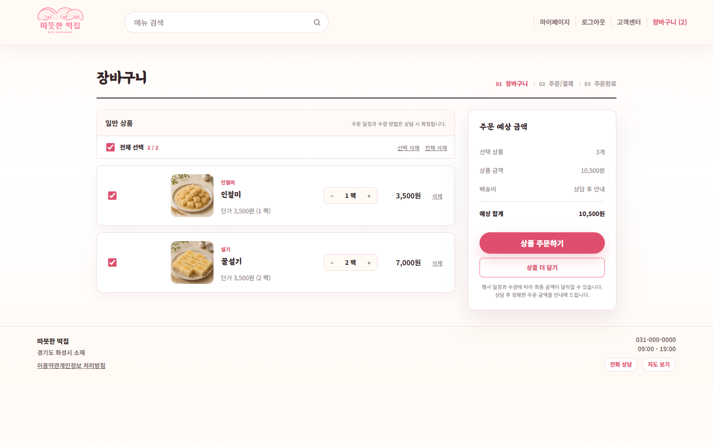
      <br />
      <strong>장바구니</strong><br />
      최신 상품 정보와 가격을 다시 조회하고, 복수 상품과 수량을 Checkout으로 전달합니다.
    </td>
    <td width="50%">
      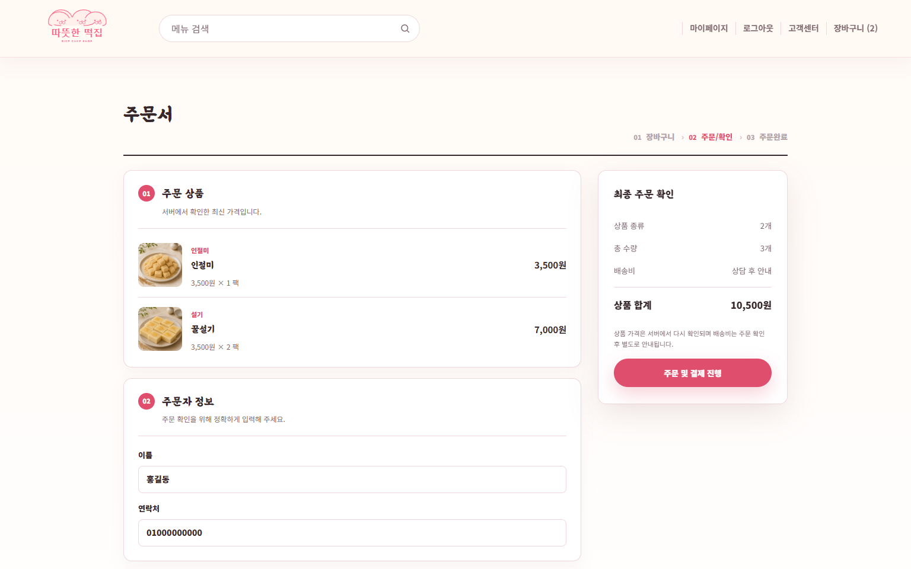
      <br />
      <strong>Checkout</strong><br />
      서버 가격 재검증과 다중 상품 snapshot을 기준으로 주문·항목·이력·payment row를 하나의 local transaction으로 저장합니다.
    </td>
  </tr>
</table>

### 관리자 운영

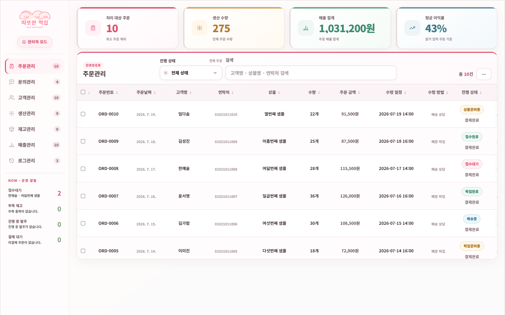

**관리자 주문 관리** — 역할별 권한 아래 주문 상태, 결제 상태와 운영 action을 관리하고, 민감 정보 열람은 별도 PII 권한 흐름으로 분리합니다.

<details>
<summary>생산·재고 관리 화면 더 보기</summary>

<table>
  <tr>
    <td width="50%">
      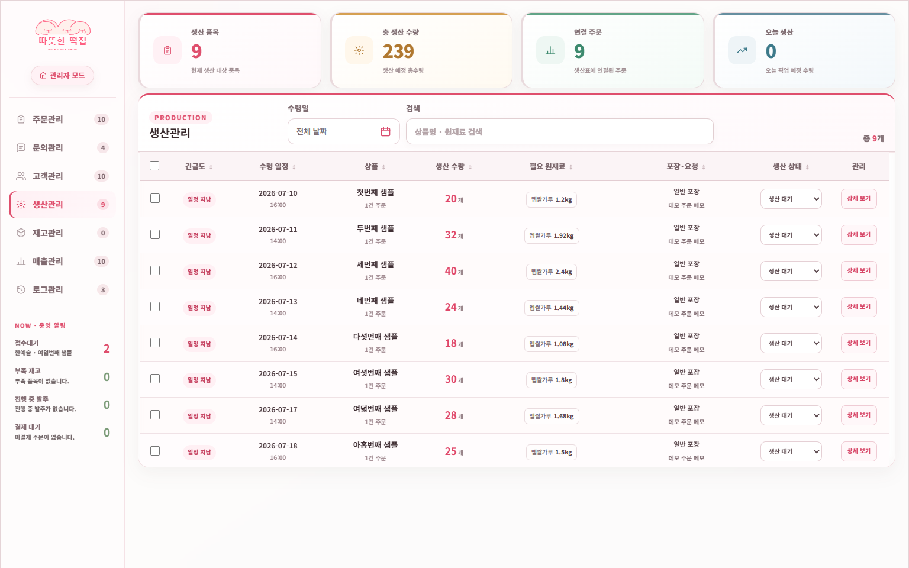
      <br />
      <strong>생산 관리</strong><br />
      생산 완료를 주문 상태, 재고 차감과 사용 이력에 하나의 transaction으로 반영합니다.
    </td>
    <td width="50%">
      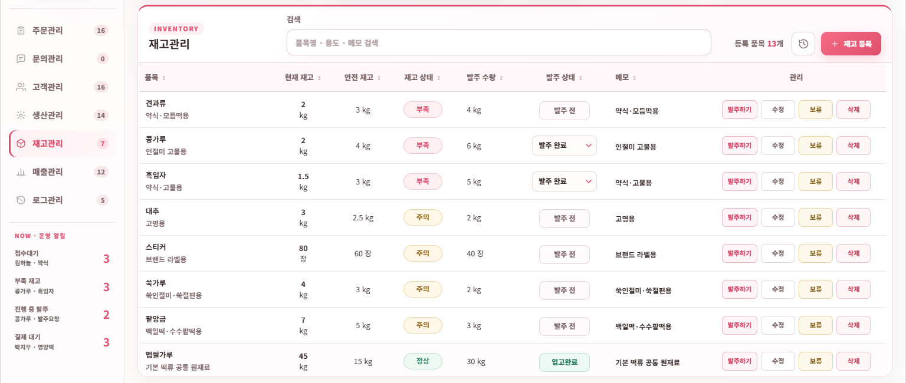
      <br />
      <strong>재고 관리</strong><br />
      현재 수량, 안전재고, 사용 이력과 발주 흐름을 주문 생산 과정과 연결합니다.
    </td>
  </tr>
</table>

</details>

### 개인정보 보호

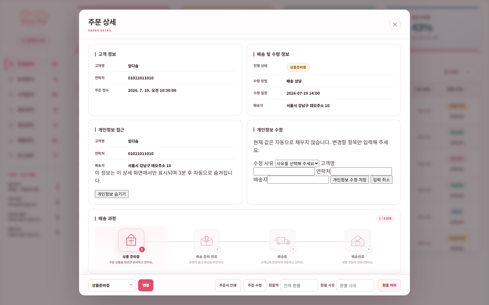

**PII 제한 열람** — 일반 화면의 민감 정보 접근과 분리해, 별도 permission·업무 사유·rate limit·감사를 통과한 요청에만 제한적으로 원문을 제공합니다.

<details>
<summary>기존 고객·모바일·매출 화면 더 보기</summary>

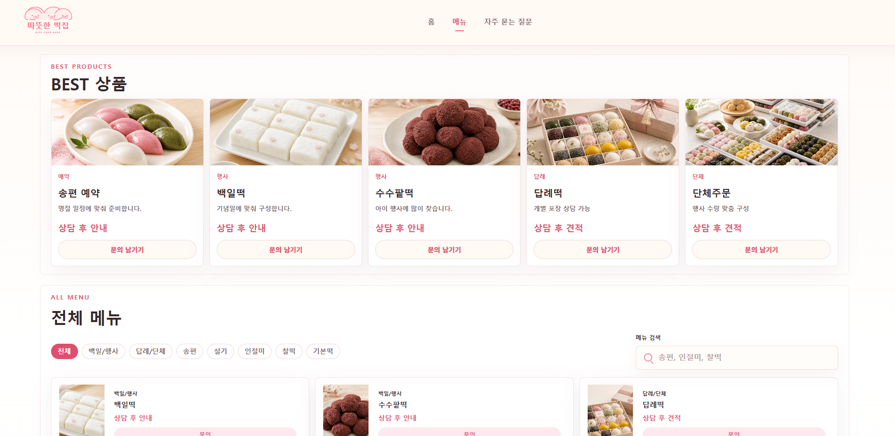

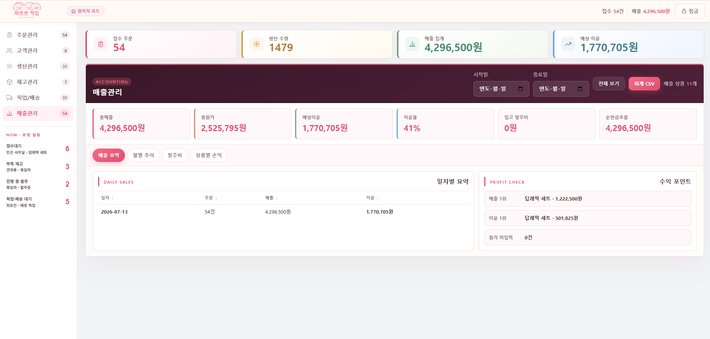

| 모바일 홈 | 모바일 상품 |
| --- | --- |
|  | 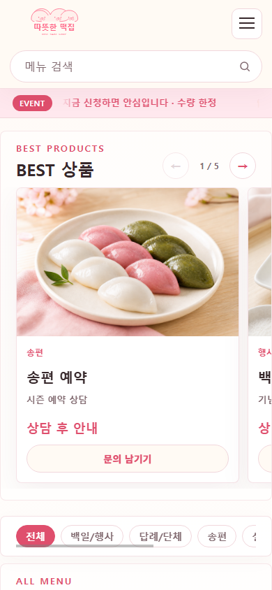 |

</details>

## 주요 기능

### 고객

| 기능 | 구현 내용과 포트폴리오 가치 |
| --- | --- |
| 상품 목록·검색·카테고리 | 서버 카탈로그 30개를 기준으로 활성 상품만 노출하고 검색·분류·페이지네이션을 제공합니다. |
| 상품 상세 | 직접 구매 상품과 상담 전용 상품을 구분하고, 대표·상세 이미지, 원산지, 판매 단위별 가격을 구매 또는 문의 흐름으로 연결합니다. |
| 장바구니 | 수량·선택 상태를 관리하고 주문 전 서버의 최신 가격과 판매 상태로 다시 조정합니다. |
| 일반 주문 | 상품 ID만 신뢰 경계 안으로 받고 이름·가격·판매 상태는 서버 DB에서 결정합니다. |
| Checkout | 다중 상품, 서버 가격 재검증, 필수 `Idempotency-Key`, 주문·결제 row의 동일 transaction을 적용합니다. |
| 회원 주문 | HTTP-only 고객 쿠키를 사용하며 본인 주문 목록·상세·허용 상태 취소만 제공합니다. |
| 비회원 주문·조회 | 휴대폰 인증을 한 번만 소비하고 조회 비밀번호를 hash로 저장합니다. |
| 회원가입·로그인 | 아이디·이메일 로그인, bcrypt 비밀번호, 휴대폰 코드 HMAC, 반복 실패 잠금을 적용합니다. |
| 소셜 로그인 | Google·Kakao·Naver OAuth 연결 및 신규 사용자 동의 흐름을 제공합니다. 실제 사용에는 provider 설정이 필요합니다. |
| 비밀번호 재설정 | 계정 존재 여부를 감추는 응답과 만료되는 일회용 이메일 링크를 사용합니다. |
| 결제 링크·결제 | hash로 저장한 일회성 링크와 제한 시간 session을 거쳐 Toss 승인 요청을 수행합니다. |
| 상품 문의 | 회원·비회원 문의 접수, 본인 조회·수정과 관리자 답변 흐름을 제공합니다. |

### 관리자 ERP와 RBAC

| 영역 | Permission | 구현 내용 |
| --- | --- | --- |
| 주문 | `orders:read`, `orders:write` | 조회·등록·수정, 상태 이력, 다중 상품, 결제 링크 발급·재발급 |
| 결제 | `payments:read`, `payments:reconcile`, `payments:cancel` | 결제 요약, provider 조회 기반 reconcile, 전체·부분 취소 |
| 주문 PII | `orders:pii:read`, `orders:pii:write` | 사유가 있는 제한적 열람·수정, no-store 응답, 구조화 감사 로그 |
| 문의·고객 | 주문 권한과 관리자 인증 | 문의 답변·상태, 고객 메모와 주문·매출 집계 |
| 생산 | `orders:write` | 생산 완료, 재고 차감과 사용 이력을 하나의 transaction으로 반영 |
| 재고·발주 | `inventory:*`, `purchase_orders:*` | 안전재고, 사용 이력, 발주·입고와 공급처 관리 |
| 매출 | 주문·결제 조회 권한 | 일자·상품별 매출, 원가, 이익과 CSV |
| 운영 로그 | `activity_logs:read` | 인증, 권한 거부, 주문·결제·PII·외부 연동 활동 조회 |
| 관리자 계정 | `admin_users:manage` | 역할·활성 상태 변경, token version 기반 세션 회수 |
| 상품 관리 | `products:read`, `products:write` | 상품 등록·수정·판매 중지, 노출 순서, 대표·상세 이미지, 원산지와 팩·반말·한말 단위 관리 |
| Naver Commerce | `sales_channels:read`, `sales_channels:manage` | 판매 단위별 상품 매핑, 주문 수집·내부 주문 변환·상태 동기화·발송 처리의 서버 기반 구현 |

RBAC 역할은 `super_admin`, `operations`, `finance`, `viewer`입니다. Naver Commerce는 API와 서버 기반을 구현한 상태이며 전용 관리자 UI 전체가 완성됐다는 의미는 아닙니다. 백업을 실행하는 HTTP UI나 자동 restore API도 의도적으로 제공하지 않습니다.

## 시스템 아키텍처

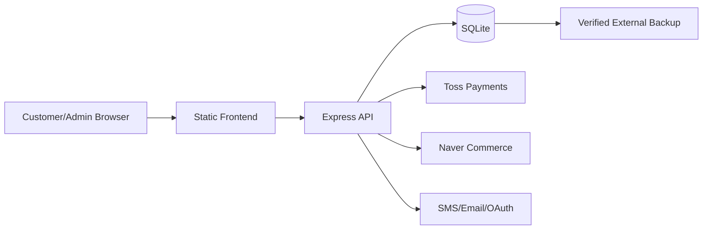
```mermaid
flowchart LR
  Browser[Customer/Admin Browser] --> Web[Static Frontend]
  Web --> API[Express API]
  API --> DB[(SQLite)]
  API --> Toss[Toss Payments]
  API --> Naver[Naver Commerce]
  API --> Notify[SMS/Email/OAuth]
  DB --> Backup[Verified External Backup]
```

- 빌드 과정 없는 HTML/CSS/Vanilla JavaScript 모듈을 Express가 API와 같은 origin에서 제공합니다.
- SQLite는 개인 프로젝트와 단일 매장 규모를 위한 선택이며, 영구 볼륨의 단일 애플리케이션 인스턴스를 전제로 합니다.
- 외부 provider는 adapter/service 경계 뒤에 두며, 설정하지 않은 연동은 비활성 상태로 실행할 수 있습니다.

상세 구성과 경계는 [아키텍처 문서](docs/architecture.md)를 참고합니다.

## 주문·결제 흐름

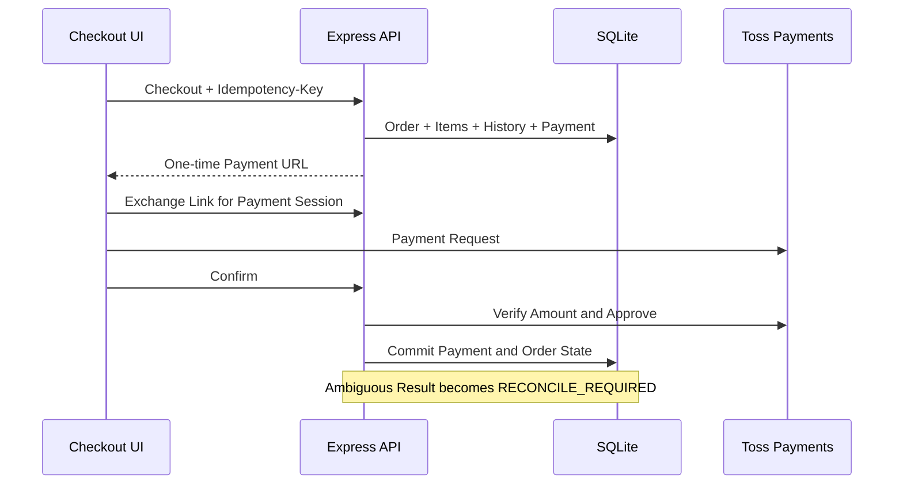
```mermaid
sequenceDiagram
  participant UI as Checkout UI
  participant API as Express API
  participant DB as SQLite
  participant Toss as Toss Payments

  UI->>API: Checkout + Idempotency-Key
  API->>DB: Order + Items + History + Payment
  API-->>UI: One-time Payment URL
  UI->>API: Exchange Link for Payment Session
  UI->>Toss: Payment Request
  UI->>API: Confirm
  API->>Toss: Verify Amount and Approve
  API->>DB: Commit Payment and Order State
  Note over API,DB: Ambiguous Result becomes RECONCILE_REQUIRED
```

Checkout은 주문, 상품 snapshot, 상태 이력, payment row와 비회원 인증 소비를 하나의 local transaction으로 저장합니다. 이 단계의 payment link 생성은 Toss 호출이 아닙니다. 고객이 결제를 진행하고 confirm API가 금액·주문 ID·session을 검증한 뒤 provider 승인을 요청합니다.

Provider 성공 후 local DB 반영이 실패하거나 timeout으로 결과를 확정할 수 없으면 결제를 `RECONCILE_REQUIRED`로 남깁니다. 관리자 reconcile은 Toss 조회 결과와 local 상태를 다시 대조하며, 승인·webhook·reconcile·전체/부분 취소는 각각 중복 실행 안전성을 갖습니다.

## PII 보호 흐름

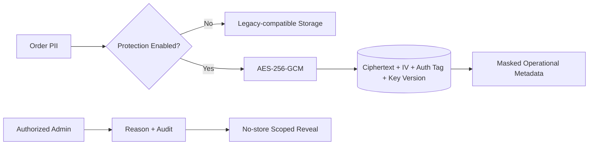
```mermaid
flowchart LR
  Input[Order PII] --> Flag{Protection Enabled?}
  Flag -->|No| Legacy[Legacy-compatible Storage]
  Flag -->|Yes| Encrypt[AES-256-GCM]
  Encrypt --> Cipher[(Ciphertext + IV + Auth Tag + Key Version)]
  Cipher --> Mask[Masked Operational Metadata]
  Admin[Authorized Admin] --> Audit[Reason + Audit]
  Audit --> Reveal[No-store Scoped Reveal]
```

- AES-256-GCM, 매 암호화마다 생성되는 random IV와 authentication tag를 사용합니다.
- versioned keyring은 active write key와 historical decrypt key를 함께 관리합니다.
- 보호된 row는 평문 컬럼을 placeholder/`NULL`로 비우고, 일반 업무에는 마스킹된 이름·전화·배송 지역만 제공합니다.
- PII read/write permission, 허용 사유, 사용자별 rate limit과 감사 로그를 적용합니다.
- keyring·복호화·감사 저장이 실패하면 보호값을 반환하지 않는 fail-closed 정책을 사용합니다.
- legacy 주문 backfill과 payment 테이블의 중복 PII purge는 startup migration이 아닌 별도 CLI로 수행합니다.

실제 key, keyring, 고객 데이터와 운영 경로는 저장소 문서에 기록하지 않습니다.

## 운영 안정성

1. Provider 성공 후 DB 실패를 `RECONCILE_REQUIRED`로 보존하여 잘못된 재승인과 상태 단정을 피합니다.
2. 주문·checkout·생산 완료·결제 상태 반영·취소·PII 변경을 transaction과 rollback으로 보호합니다.
3. 주문, checkout, 승인, reconcile과 취소에 idempotency 또는 상태 잠금을 적용합니다.
4. 진행 주문·결제·이력이 연결된 데이터와 일괄 삭제를 차단하고 허용된 삭제도 감사와 함께 수행합니다.
5. 운영 필수 설정, HTTPS origin, 외부 DB·백업 경로, demo seed와 mock 결제를 시작 전에 검증합니다.
6. SQLite backup snapshot에 checksum, integrity, foreign key와 필수 테이블 검증을 적용합니다.
7. backfill/purge는 `dry-run`·`apply`·`verify`, 안전한 report, process lock과 bounded busy retry를 제공합니다.
8. 실제 전환 순서와 중단·rollback 판단은 별도 production activation runbook으로 관리합니다.

## 기술적 의사결정

| 문제 | 선택 | 이유 | Trade-off |
| --- | --- | --- | --- |
| 개인 프로젝트 DB 운영 | `node:sqlite` | 별도 DB 서버 없이 transaction·FK·migration을 직접 검증 | 단일 writer와 단일 instance 제약 |
| 네트워크 재시도 중 중복 주문 | Idempotency key | 동일 요청 재전송을 기존 결과로 수렴 | key 수명과 request hash 관리 필요 |
| Provider 처리 결과 불명 | `RECONCILE_REQUIRED` | 성공을 실패로 오판해 중복 승인하는 위험 방지 | 상태 모델과 운영 확인 절차 증가 |
| 기존 PII의 점진 전환 | Feature flag + legacy adapter | 코드 배포와 데이터·key 활성화를 분리 | 전환 기간 두 저장 형태 지원 필요 |
| 암호화 key 교체 | Versioned keyring | 새 write key와 과거 데이터 복호화를 동시에 지원 | key 보관·폐기 정책 필요 |
| Payment PII 중복 | Payment PII를 `NULL`로 유지 | 주문 PII adapter를 단일 원천으로 사용 | 주문 데이터 가용성에 의존 |
| 위험한 데이터 작업 | One-off CLI와 수동 restore | startup/HTTP 경로에서 파괴적 작업 제거 | 승인된 운영 절차와 점검 시간 필요 |

구현 배경과 검증은 [포트폴리오 Case Study](docs/portfolio-case-study.md)에 정리했습니다.

## 기술 스택

| 구분 | 기술 | 실제 사용 범위 |
| --- | --- | --- |
| Frontend | HTML5, CSS3, Vanilla JavaScript modules | bundler 없이 화면·상태·접근성 구성, 장바구니·최근 검색에 localStorage 사용 |
| Backend | Node.js 22.16+, Express 4 | 정적 allowlist, REST API, middleware와 service 경계 |
| Database | `node:sqlite` | transaction, FK, index, version 16까지의 자동 migration |
| Authentication | JWT, HTTP-only cookie, bcryptjs | 고객·관리자 인증 분리, 관리자 issuer/audience/token version 검증 |
| Security | AES-256-GCM, HMAC, rate limit, CSP/CORS/security headers | 주문 PII, 인증 코드, 접근 제한과 안전한 응답 정책 |
| Testing | `node:test`, Supertest, Playwright 설정 | API·DB·보안·운영 CLI·정적 UI contract와 E2E 설정 |
| Integration | Toss, Naver Commerce, Solapi, Resend, Google/Kakao/Naver OAuth | 실제 사용 시 별도 provider 설정 필요 |
| Operations | Backup/preflight CLI, Railway/Render 설정 | health check, 외부 영구 경로와 배포 준비 검증 |

## 프로젝트 구조

```text
ShoppingMall/
├─ index.html · menu.html · product.html
├─ cart.html · checkout.html · pay.html
├─ login.html · signup.html · mypage.html
├─ admin.html
├─ js/
│  ├─ api.js · state.js · cart.js · auth.js
│  └─ admin/
├─ css/ · assets/
├─ server/
│  ├─ index.js · config.js · db.js · migrations.js
│  ├─ routes/ · middleware/ · services/ · lib/
│  ├─ scripts/
│  └─ test/ · e2e/
├─ docs/
└─ railway.json · render.yaml
```

## 빠른 실행

요구 사항은 **Node.js 22.16 이상**입니다. 프런트엔드는 별도 install이나 build가 필요하지 않습니다.

```bash
cd server
npm ci
cp .env.example .env
npm start
```

Windows PowerShell에서는 복사 명령만 다음과 같이 바꿉니다.

```powershell
Copy-Item .env.example .env
```

브라우저에서 `http://localhost:3000`으로 접속합니다. `server/db.js`가 로드될 때 아직 적용되지 않은 DB migration이 순서대로 실행됩니다.

```bash
# 전체 테스트
cd server
npm test

# 읽기 중심 production 설정 점검
npm run deploy:check

# 운영 DB snapshot 생성 및 기존 backup 검증
npm run backup:create
npm run backup:verify
```

자동 restore 명령이나 HTTP restore API는 제공하지 않습니다. 복구는 검증된 backup을 사용해 승인된 점검 시간에 수동으로 진행합니다.

### 환경변수 범위

README에는 역할만 설명하며 실제 값은 기록하지 않습니다.

| 분류 | 주요 변수 |
| --- | --- |
| Local required | `JWT_SECRET`, `AUTH_CODE_PEPPER` |
| Optional | `PORT`, 공개 매장 정보, notification/email/OAuth 설정 |
| Payment | `PAYMENT_MODE`, Toss client/secret, non-production mock 설정 |
| Production | 외부 `DB_PATH`, `BACKUP_DIR`, HTTPS origin, DB 관리자 계정 |
| Naver Commerce | Commerce client, auth type와 필요한 account ID |
| PII activation | `ORDER_PII_PROTECTION_ENABLED`, `ORDER_PII_KEYS_JSON`, `ORDER_PII_ACTIVE_KEY_VERSION` |

기본 계약은 `server/.env.example`, 운영 제약은 [Production Readiness](docs/production-readiness.md)와 [PII Production 활성화 Runbook](docs/order-pii-production-activation.md)을 참고합니다.

## Demo

일반 실행과 별도로 공개 포트폴리오용 계정을 준비할 수 있습니다. 이 seed는 production에서 차단되며 운영 계정과 무관합니다.

macOS/Linux:

```bash
ALLOW_PORTFOLIO_SEED=true npm run users:portfolio
```

Windows PowerShell:

```powershell
$env:ALLOW_PORTFOLIO_SEED="true"
npm run users:portfolio
```

| 체험 대상 | 주소 | 공개 Demo 계정 |
| --- | --- | --- |
| 고객 화면 | `/` | 상품 탐색은 로그인 없이 가능 |
| 고객 로그인 | `/login.html` | `portfolio_user` / `User123!` |
| 관리자 ERP | `/admin.html` | `portfolio_admin` / `Admin123!` 로그인 후 관리자 세션 진입 |
| 상태 확인 | `/api/health` | DB 연결과 migration version 확인 |

- 실제 provider key 없이 상품·주문·관리자 ERP와 대부분의 local 흐름을 시연할 수 있습니다.
- Toss mock은 non-production에서만 사용합니다.
- 실제 휴대폰·이메일·OAuth·Toss·Naver 호출은 각 provider 설정이 필요합니다.
- backup, restore, PII backfill/purge와 activation runbook은 Demo 절차에 포함하지 않습니다.

## 테스트

2026-08-11 기준 `npm test`를 다시 실행한 결과입니다.

```text
tests   548
passed  548
failed  0
skipped 0
```

주요 검증 영역:

- 주문·checkout의 가격 검증, transaction, rollback과 idempotency
- 결제 승인·webhook·reconcile·전체/부분 취소와 동시성
- PII write/read/access/update/backfill/purge와 fail-closed 정책
- 관리자 DB 계정, RBAC, token version과 session revoke
- backup 생성·검증·복구 계약
- Naver 인증·판매 단위별 상품 매핑·주문 수집·내부 주문 변환·상태 동기화·발송 처리
- production config, readiness, seed 차단과 정적 공개 경계
- 파괴적 작업 제한, 관리자 UI contract와 접근성

Coverage 백분율은 측정 결과가 없으므로 주장하지 않습니다.

## 대표 PR

| PR | 해결한 문제 | 핵심 구현과 가치 |
| --- | --- | --- |
| [#3](https://github.com/wlrjs1300-coder/ShoppingMall/pull/3) | Provider 결과와 local 결제 상태 불일치 | 조회 기반 reconcile과 `RECONCILE_REQUIRED` 상태 |
| [#4](https://github.com/wlrjs1300-coder/ShoppingMall/pull/4) | 동시 취소와 환불 금액 정합성 | 취소 상태 잠금, 전체·부분 취소, 멱등 반영 |
| [#8](https://github.com/wlrjs1300-coder/ShoppingMall/pull/8) | 재배포·장애에 대비한 SQLite 보호 | 외부 snapshot, checksum, integrity/FK 검증과 수동 복구 원칙 |
| [#9](https://github.com/wlrjs1300-coder/ShoppingMall/pull/9) | 공유 관리자 코드와 과도한 권한 | DB 관리자 계정, 역할별 permission, token version 세션 회수 |
| [#15](https://github.com/wlrjs1300-coder/ShoppingMall/pull/15) | Naver 주문 수집 중 중복·부분 실패 | cursor, run lock, 재처리 가능한 주문 수집 orchestration |
| [#16](https://github.com/wlrjs1300-coder/ShoppingMall/pull/16) | 주문 PII 평문 저장과 key 교체 | AES-256-GCM, versioned keyring, 마스킹 metadata |
| [#18](https://github.com/wlrjs1300-coder/ShoppingMall/pull/18) · [#19](https://github.com/wlrjs1300-coder/ShoppingMall/pull/19) | 관리자 PII의 일상적 노출·수정 | permission, 사유, rate limit, no-store와 원자적 감사 |
| [#20](https://github.com/wlrjs1300-coder/ShoppingMall/pull/20)–[#23](https://github.com/wlrjs1300-coder/ShoppingMall/pull/23) | 코드 배포와 production 데이터 전환 위험 | 암호화 write, backfill/purge CLI와 activation runbook |

상세한 문제·선택·검증·trade-off는 [포트폴리오 Case Study](docs/portfolio-case-study.md)를 참고합니다.

## Production readiness

| 상태 | 범위 |
| --- | --- |
| **Implemented** | 고객·관리자 기능, 주문·결제 안전장치, RBAC, PII 암호화·감사, backfill/purge 도구, backup create/verify, Naver 연동 기반, 자동 테스트 |
| **Operationally Prepared** | production config check, backup/restore 및 PII activation runbook, dry-run/apply/verify, smoke checklist와 rollback 기준 |
| **Not Yet Activated in Production** | 실제 backup/restore rehearsal, 운영 데이터 backfill/purge, production keyring과 flag ON, production smoke, 실 Toss credential 검증, domain/HTTPS, monitoring, 사업·법률 검토 |

이 저장소는 운영을 고려한 구현과 절차를 갖췄지만 **실제 서비스 활성화와 운영 환경 검증은 아직 남아 있습니다.**

## Roadmap

### Phase 1 — Portfolio Publish

README·아키텍처·case study를 정리하고 핵심 화면과 짧은 시연 영상을 추가합니다. 완료 기준은 저장소 첫 화면에서 기능, 설계 근거, 검증 수준과 한계를 5분 안에 확인할 수 있는 상태입니다.

### Phase 2 — Staging Validation

격리된 staging DB/env에서 backup·restore, synthetic smoke, backfill/purge와 rollback을 rehearsal합니다. 완료 기준은 실제 고객 데이터 없이 전체 전환 절차와 증거를 재현하는 것입니다.

### Phase 3 — Production Activation

승인된 keyring과 maintenance window를 준비하고 backfill/purge, flag 활성화, restart, readiness·smoke·monitoring을 순서대로 수행합니다. 완료 기준은 runbook gate와 사후 점검을 모두 통과하는 것입니다.

### Phase 4 — Service Hardening

Domain/HTTPS, 실제 Toss 검증, 로그·경보, CI/CD, 부하 테스트와 SQLite 확장성 검토를 진행합니다. 완료 기준은 관측 가능한 배포·장애 대응과 다음 데이터베이스 전환 기준을 정하는 것입니다.

## 문서

- [System Architecture](docs/architecture.md)
- [Portfolio Case Study](docs/portfolio-case-study.md)
- [Production Readiness](docs/production-readiness.md)
- [Backup and Recovery](docs/backup-and-recovery.md)
- [Order/Payment PII Production Activation](docs/order-pii-production-activation.md)
- [Order PII Backfill](docs/order-pii-backfill.md)
- [Payment PII Purge](docs/payment-pii-purge.md)
- [Admin Authentication and RBAC Operations](docs/admin-auth-operations.md)

## License와 연락처

별도 license 파일은 아직 추가하지 않았습니다. 공개 재사용 범위는 license 확정 전까지 저장소 소유자의 권리를 따릅니다.

- GitHub: [wlrjs1300-coder/ShoppingMall](https://github.com/wlrjs1300-coder/ShoppingMall)
