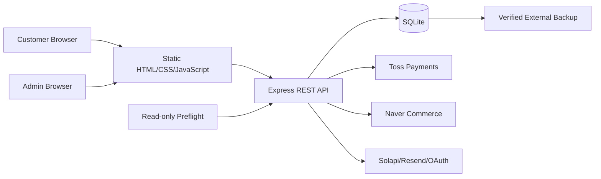
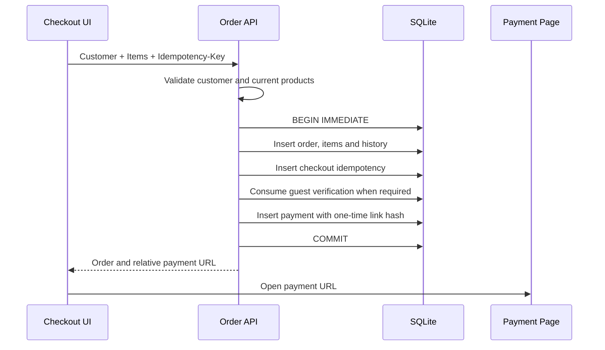
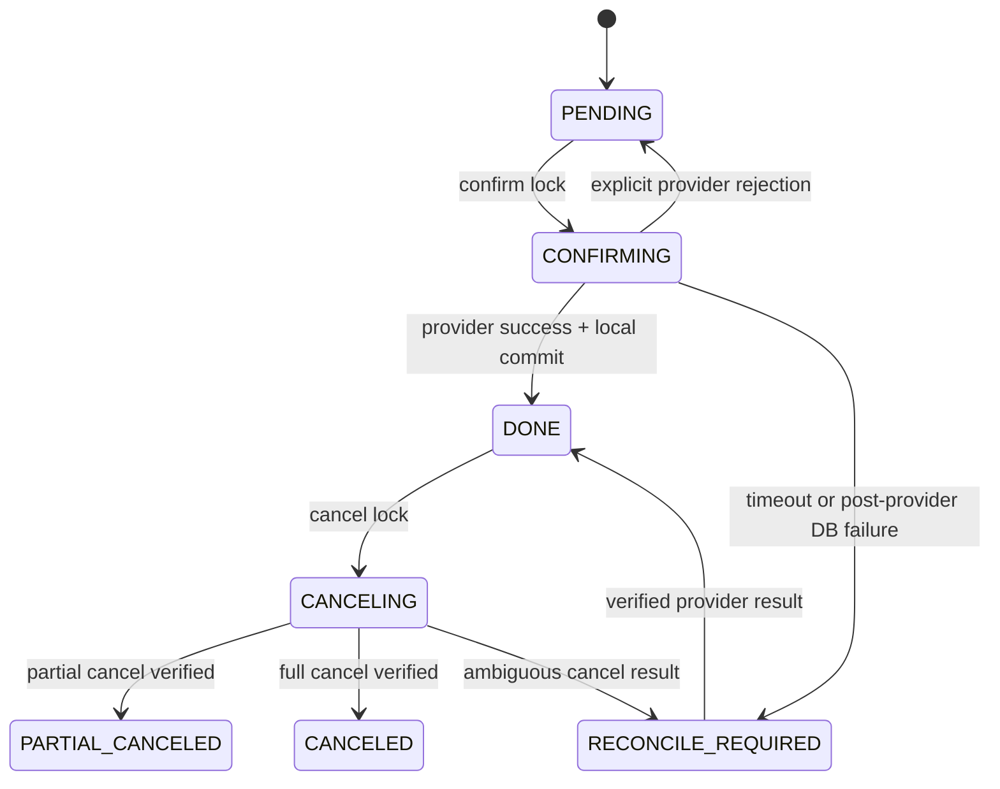
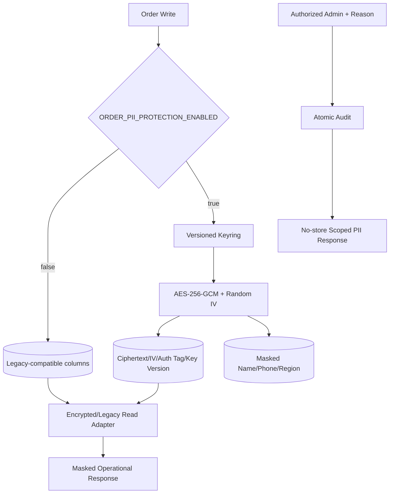
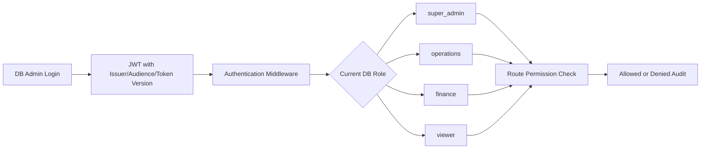

# System Architecture

이 문서는 따뜻한 떡집의 주요 실행 경계와 데이터 흐름을 설명합니다. 구현된 구조와 production에서 실제로 활성화된 상태를 구분하며, secret·실제 고객 데이터·운영 경로는 다루지 않습니다.

## 1. System overview



Express는 공개 allowlist에 포함된 정적 화면과 `/api/*`를 같은 origin에서 제공합니다. 서버 소스, 내부 문서, 환경 파일, DB와 backup 경로는 정적 파일로 공개하지 않습니다.

외부 연동은 service/client 경계 뒤에 있습니다. provider 설정이 없는 local 환경에서는 비활성 또는 명시적인 non-production mock으로 실행할 수 있으며, production readiness 검사는 모의 설정과 placeholder를 거부합니다.

## 2. Frontend, backend, database

### Frontend

- HTML5, CSS3와 역할별 Vanilla JavaScript 모듈로 구성합니다.
- 별도 bundler나 root package install이 없습니다.
- 공통 API wrapper와 UI component를 사용하고, 장바구니·최근 검색처럼 브라우저에 적합한 상태만 localStorage에 둡니다.
- 고객 인증은 HTTP-only cookie를 사용하므로 인증 token을 JavaScript storage에 저장하지 않습니다.
- 관리자 UI는 서버가 발급한 관리자 JWT의 permission 목록에 따라 민감한 control을 숨기고, 서버가 다시 권한을 강제합니다.

### Backend

- Node.js 22.16+와 Express 4를 사용합니다.
- route는 입력·인증·권한과 HTTP 응답을 담당하고, 복잡한 provider·PII·운영 작업은 service/lib로 분리합니다.
- 요청 ID, JSON 오류 로그, CSP/CORS/security headers와 rate limit을 공통 middleware로 적용합니다.
- 고객 cookie 인증과 관리자 Bearer 인증의 신뢰 경계를 분리합니다.

### Database

- `node:sqlite` 기반 단일 SQLite DB를 사용합니다.
- foreign key, index, check constraint, explicit transaction과 versioned migration을 적용합니다.
- `server/db.js`가 로드될 때 아직 적용되지 않은 migration을 순서대로 실행하며 현재 최신 version은 16입니다.
- 개인 프로젝트와 단일 매장 규모에서 단순성과 transaction 검증을 우선한 선택입니다. 다중 application instance 또는 높은 write concurrency가 필요하면 PostgreSQL 등의 client/server DB로 전환해야 합니다.

## 3. Order flow

일반 주문은 다음 순서를 따릅니다.

```text
입력 형식 검증
→ 활성 상품을 DB에서 조회
→ 서버 가격·상품명·판매 상태 결정
→ Idempotency-Key와 request hash 확인
→ BEGIN IMMEDIATE
→ order + items + status history 저장
→ idempotency record 저장
→ COMMIT
→ 알림 비동기 요청
→ 마스킹된 응답
```

클라이언트가 전달한 가격, 상품명, 원가, 주문 ID와 상태는 저장 기준으로 사용하지 않습니다. 주문 항목에는 주문 당시 상품명과 가격 snapshot을 남겨 이후 카탈로그 변경이 과거 주문 금액을 바꾸지 않게 합니다.

멱등성 key가 이미 존재하면 request hash를 비교합니다. 같은 입력이면 기존 결과를 반환하고, 다른 입력이면 충돌로 거부합니다.

## 4. Checkout atomicity



Checkout은 다음 값을 하나의 local transaction으로 묶습니다.

- 주문 헤더와 다중 상품 snapshot
- 최초 상태 이력
- checkout idempotency record
- 비회원 주문의 검증된 휴대폰 인증 1회 소비
- payment row와 일회성 결제 링크 hash

어느 단계에서든 실패하면 모두 rollback합니다. payment link는 local capability URL일 뿐 Toss API 호출이 아닙니다. 링크 token 원문은 DB에 저장하지 않고 hash와 만료 시각을 저장하며, 사용 후 제한 시간 payment session으로 교환합니다.

## 5. Payment lifecycle



Confirm 단계는 session, order ID, payment key와 금액을 대조한 뒤 Toss 승인을 요청합니다. provider가 명확히 거절하면 재시도 가능한 local 상태로 복구할 수 있지만 timeout, 5xx 또는 provider 성공 뒤 DB 반영 실패는 결과를 추측하지 않습니다.

승인·webhook·reconcile이 겹쳐도 같은 결제를 한 번만 반영하도록 상태 조건과 transaction을 사용합니다. 관리자가 주문 수정 API로 온라인 결제 상태를 직접 바꿀 수 없으며, 결제가 완료되지 않은 온라인 주문은 생산·배송 상태로 진행할 수 없습니다.

## 6. Reconcile model

Reconcile은 local `payment_key`로 provider 상태를 조회하고 다음을 확인합니다.

- provider의 주문 ID와 local 주문 ID가 같은가
- 승인 금액과 local 결제 금액이 같은가
- provider 상태가 자동 복구를 허용하는 상태인가
- 이미 반영된 승인·webhook·취소 이력과 충돌하지 않는가

금액, 주문 ID 또는 payment key가 일치하지 않으면 자동 복구하지 않습니다. provider 조회가 다시 timeout/5xx로 끝나면 `RECONCILE_REQUIRED`를 유지합니다. 성공적으로 복구하더라도 이미 더 진행된 업무 workflow를 이전 상태로 후퇴시키지 않습니다.

## 7. PII storage model



주문 PII payload는 고객명, 전화번호와 필요한 배송 주소를 함께 canonical JSON으로 만든 뒤 AES-256-GCM으로 암호화합니다. 각 write는 새로운 12-byte IV를 사용하며 ciphertext, IV, authentication tag와 key version이 완전한 tuple을 이뤄야 합니다.

Keyring은 다음 원칙을 가집니다.

- active version은 신규 write에 사용합니다.
- historical version은 기존 ciphertext 복호화에 남겨 둡니다.
- key는 정확한 길이와 canonical encoding을 검증합니다.
- keyring은 환경에서 주입하며 DB나 문서에 포함하지 않습니다.

암호화 row의 평문 이름·전화는 placeholder로, 주소 계열은 `NULL`로 전환합니다. 운영 목록과 export에는 마스킹 metadata만 제공하며 crypto column은 응답하지 않습니다. 암호화 tuple이 손상됐거나 key version을 찾을 수 없으면 legacy 평문으로 fallback하지 않습니다.

## 8. RBAC



- `super_admin`: 전체 permission과 관리자 계정·PII 수정 권한
- `operations`: 주문·PII 열람·재고·발주 중심의 운영 권한
- `finance`: 결제 조회·reconcile·취소 중심의 재무 권한
- `viewer`: 주문·재고·발주·결제·로그의 읽기 권한

서명만 확인하지 않고 JWT issuer, audience, algorithm, expiry와 DB의 현재 token version·role·활성 상태를 확인합니다. 역할 변경, 비밀번호 변경 또는 명시적 session revoke는 token version을 증가시켜 기존 token을 무효화합니다. 마지막 활성 `super_admin`을 비활성화하거나 강등하는 작업은 차단합니다.

PII read/write는 일반 주문 read/write와 별도 permission입니다. 허용된 업무 사유와 rate limit을 통과해야 하며, 감사 로그 저장이 실패하면 응답이나 변경도 실패합니다.

## 9. Backup and recovery

Backup은 운영 DB와 다른 외부 디렉터리에 생성하는 것을 전제로 합니다.

```text
SQLite online backup API
→ temporary snapshot
→ integrity/FK/required-table validation
→ checksum + minimal metadata
→ atomic finalization
→ retention after successful backup only
```

검증은 checksum을 확인한 뒤 임시 디렉터리의 복사본을 열어 `integrity_check`, `foreign_key_check`, 필수 테이블과 주요 조회를 검사합니다. 원본 backup과 운영 DB는 변경하지 않습니다. source DB path, record 내용과 key material은 metadata에 넣지 않습니다.

HTTP restore API와 자동 복구 script는 제공하지 않습니다. 복구는 트래픽 차단, 프로세스 중지, backup 검증, 기존 DB 보존, 검증된 파일 교체와 smoke check가 필요한 승인된 수동 작업입니다. 상세 절차는 [Backup and Recovery](backup-and-recovery.md)에 있습니다.

## 10. Legacy transition

코드 배포, 데이터 변환과 flag 활성화를 한 번에 수행하지 않습니다.

```text
backup + verify
→ isolated restore rehearsal
→ maintenance/write freeze
→ order PII dry-run
→ order PII apply + verify
→ payment PII dry-run
→ payment PII apply + verify
→ activation gate
→ keyring + flag ON
→ restart/readiness/synthetic smoke
→ monitoring
```

Order backfill과 payment purge는 공통 안전장치를 가집니다.

- 기본 또는 명시적인 dry-run
- apply 전 blocker 분류
- deterministic batch와 compare-and-update
- `BEGIN IMMEDIATE`와 bounded busy retry
- 중복 runner 방지 lock과 stale lock 처리
- allowlist 기반 report, atomic write와 overwrite 거부
- 전체 테이블 verify
- production에서 별도 확인 인자 요구

Migration이나 server startup hook으로 실행하지 않기 때문에 예상치 못한 배포 시점의 대량 변경을 피할 수 있습니다. 대신 운영자가 runbook gate와 결과 증거를 관리해야 합니다.

## 11. Operational boundaries

### Implemented

- 고객·관리자 UI와 API
- 주문·결제 transaction, idempotency, reconcile와 취소 안전장치
- 관리자 DB 계정, RBAC와 session revoke
- 주문 PII 암호화, 마스킹, 열람·수정 감사
- backup, backfill, purge와 production preflight 도구
- Naver Commerce 인증·상품 매핑·주문 수집 기반
- 488개 자동 테스트

### Operationally Prepared

- production config와 경로 검증
- backup/restore 및 PII activation runbook
- dry-run/apply/verify와 synthetic smoke checklist
- 장애 유형별 중단·재시도·rollback 원칙

### Not Yet Activated in Production

- 실제 운영 backup/restore rehearsal
- 실제 고객 데이터 backfill/purge
- production keyring 배치와 보호 flag 활성화
- 실제 Toss/Naver credential을 사용한 production 검증
- domain/HTTPS, monitoring/alert와 법률·사업 검토

## 12. Trade-offs

| 선택 | 얻은 것 | 감수한 것 | 전환 신호 |
| --- | --- | --- | --- |
| Same-origin static frontend + API | 인증·CORS·배포 단순화 | 프런트 독립 배포 제한 | 별도 프런트 팀·CDN 최적화 필요 |
| SQLite | 낮은 운영 복잡도와 강한 local transaction | 단일 writer·단일 instance | write 경합·수평 확장 요구 증가 |
| State + reconcile | provider 불명 상태의 안전한 복구 | 상태와 운영 절차 복잡도 | 결제 event/outbox 플랫폼 도입 |
| Feature-flagged PII transition | 점진적 전환과 rollback 경계 | legacy/encrypted 동시 지원 | 전환 완료 후 legacy 제거 migration |
| Versioned application keyring | key rotation과 historical decrypt | 외부 key lifecycle 운영 필요 | KMS/HSM 기반 envelope encryption 도입 |
| One-off operational CLI | 위험 작업을 request/startup에서 분리 | 운영자 승인·실행 필요 | 검증된 job runner와 approval workflow 도입 |
| Manual restore | 원격 파괴 작업 최소화 | 복구 시간과 수동 단계 증가 | 반복 rehearsal 후 제한된 자동화 도입 |
